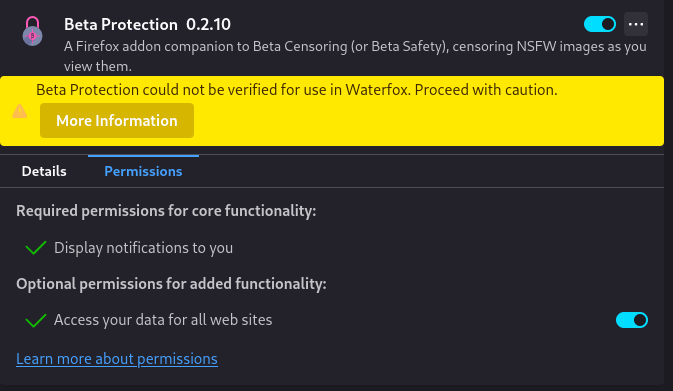

# Beta Protection

A Firefox addon that integrates a censoring backend into your browser (like Beta Censoring or Beta Safety), censoring NSFW images as you view them.

### Installation

1. In Firefox, go to `about:addons`
2. Click on cog in upper right corner -> Install Add-on From File...
3. Select `betaprotection.zip` where you downloaded/built it
4. Ignore any warnings :b
5. Click on the addon, go to permissions tab
6. Make sure `Access your data for all web sites` is toggled on (as shown below)

### Build Instructions

1. Clone the repo
2. Run `npm i`
3. Run `npm run build`
A `betaprotection.zip` file should be in the repo root folder. Now you should be able to continue with installation.

~~If you want to work on it live, run `npm run serve` instead, then load from the `dist/` directory as usual. The project will rebuild on changes, and Webpack will hot reload the extension in your browser.~~

No clue how you'd work on it live on firefox i'm sure you can but not like this at least i don't think. I would probably just develop on chrome with the base repo and copy over the manifest from here once done

### Known issues

* video blurring seems to be not working and can't be bothered to find out why at this time
* stickers may only load when in custom directories (won't show with .betapkg) - could be (and most likely is) my backend though

